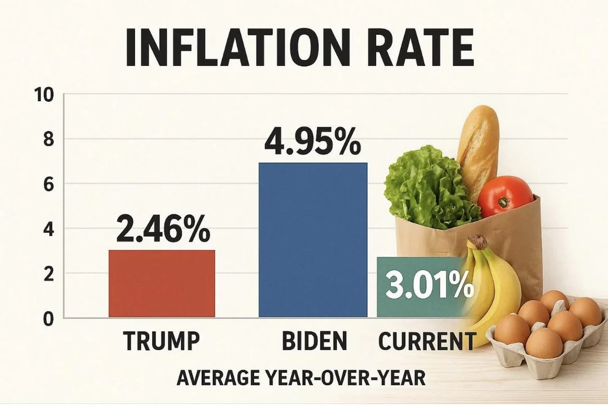

```{r}
library('tidyverse')
library('lubridate')
inflation_df <- read_csv('data/inflation_rate.csv')
```

Attach libraries and load historical inflation data.

Source: <https://tradingeconomics.com/united-states/inflation-cpi>

```{r}
inflation_by_year <- inflation_df %>%
  mutate(
    inflation_rate = inflation_rate / 100,
    year = lubridate::year(date)
  ) %>%
  group_by(whose_term, year) %>%
  summarise(
    annual_inflation = prod(1 + inflation_rate) - 1,
    .groups = "drop"
  ) %>%
  mutate(
    annual_inflation_pct = if_else(
      annual_inflation > 0.1,
      annual_inflation * 10,
      annual_inflation * 100
    ),
  ) %>%
  group_by(whose_term) %>% 
  mutate(
    Mean_Inf = mean(annual_inflation_pct),
  )
```

Do operation to calculate inflation with historical data. ChatGPT was
used for this as this is a bioinformatics course and not an economics
course.

```{r}
corrected_plot <- ggplot(
  inflation_by_year, 
  aes(fill=whose_term,
      x = reorder(whose_term, annual_inflation_pct),
      y = annual_inflation_pct, 
      label = Mean_Inf
      )
  )+ 
  geom_bar(
    stat = 'summary', 
    fun = 'mean'
  ) + 
  scale_fill_manual(
    values = c(
      "Donald Trump" = "#b7513b",
      "Joe Biden"    = "#42628b",
      "Current Inflation" = '#658f81'
    )) +
  labs(
    title = 'INFLATION RATE',
    caption = '(Mean inflation rate during the presidency of Donald Trump and Joe Biden\n compared to inflation rate in september of 2025)',
    dictionary = c(whose_term = 'Term'),
    x = 'YEAR-AFTER-YEAR',
    y = 'ANNUAL INFLATION VALUE'
) + geom_text(
  stat = "summary", 
  aes(label = scales::percent(round(after_stat(y), 2)/100)),
  fun = "mean",
  size = 5, 
  vjust = -0.3,
  )+
theme(
    panel.background = element_rect(fill = '#fcfaed', colour = NA),
    plot.background = element_rect(fill = '#fcfaed', colour = NA),
    legend.position = "none",
    axis.text.x = element_text(size = 20)
  )
corrected_plot
```

Create plot and use style options to get as close as possible to the
original graph as I can with the help of GPT. What's interesting is that
when compared to the original, you can see that they had lowered the
perceived inflation rate that was showcased on the graph but the bar
still appears to be at the 7% level as you can see below:


